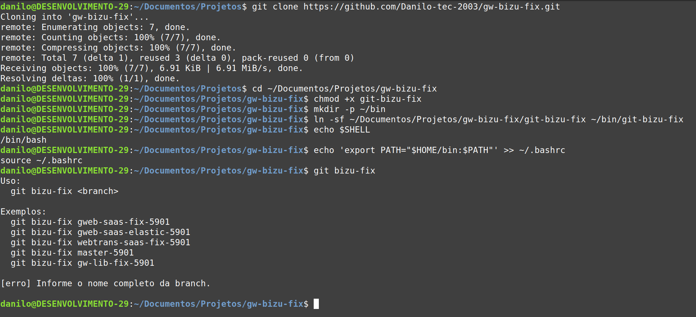

# GW Dev Tools

Ferramentas Git para apoiar o fluxo de correcao de branches dos projetos GW.

## Comandos

```bash
git bizu-fix <branch>
```

Recria uma branch de story a partir da branch base atualizada e reaplica somente os commits da story.

```bash
git bizu-fix install-hook
```

Instala o validador de mensagem de commit no repositorio atual.

## Instalacao

Clone o repositorio:

```bash
cd ~/Documentos/Projetos
git clone https://github.com/Danilo-tec-2003/gw-bizu-fix.git
cd ~/Documentos/Projetos/gw-bizu-fix
```

De permissao de execucao:

```bash
chmod +x git-bizu-fix git-bizu-commit-msg
```

Crie os links dos comandos:

```bash
mkdir -p ~/bin
ln -sf ~/Documentos/Projetos/gw-bizu-fix/git-bizu-fix ~/bin/git-bizu-fix
ln -sf ~/Documentos/Projetos/gw-bizu-fix/git-bizu-commit-msg ~/bin/git-bizu-commit-msg
```

Garanta que `~/bin` esteja no `PATH`.

Para Bash:

```bash
echo 'export PATH="$HOME/bin:$PATH"' >> ~/.bashrc
source ~/.bashrc
```

Para Zsh:

```bash
echo 'export PATH="$HOME/bin:$PATH"' >> ~/.zshrc
source ~/.zshrc
```

Valide:

```bash
git bizu-fix
```

Se estiver instalado corretamente, o terminal deve mostrar:

```text
Uso:
  git bizu-fix <branch>
```

Exemplo de instalacao validada:



## Instalacao do hook de commit

Para bloquear commits fora do padrao, instale o hook dentro de cada repositorio GW em que voce usa o fluxo:

```bash
cd ~/Documentos/Projetos/webtrans
git bizu-fix install-hook
```

Repita o comando nos outros projetos, se necessario:

```bash
cd ~/Documentos/Projetos/gweb
git bizu-fix install-hook

cd ~/Documentos/Projetos/gw-base-webtrans
git bizu-fix install-hook

cd ~/Documentos/Projetos/gw-lib
git bizu-fix install-hook
```

Depois disso, todo `git commit` feito no repositorio passa a validar a mensagem.

Exemplo bloqueado na branch `webtrans-saas-elastic-2045`:

```bash
git commit -m "testando"
```

Exemplo aceito:

```bash
git commit -m "(2045)fix: ajusta validacao"
```

## Como usar

Entre no repositorio do projeto:

```bash
cd ~/Documentos/Projetos/gweb
```

Confira se a branch existe localmente:

```bash
git branch --list gweb-saas-fix-5901
```

Se nao existir, traga a branch do remoto:

```bash
git fetch origin
git checkout gweb-saas-fix-5901
```

Confirme que nao existem alteracoes locais pendentes:

```bash
git status
```

Execute:

```bash
git bizu-fix gweb-saas-fix-5901
```

O script mostra o repositorio, a branch de trabalho, a base detectada e a story. Antes de alterar a branch, ele pede confirmacao digitando o nome completo da branch.

Ao final, revise e envie para o remoto:

```bash
git status
git log --oneline --decorate -10
git push origin gweb-saas-fix-5901 --force-with-lease
```

A branch que deve ir para o PR e sempre a branch original da story, nunca a branch de backup.

## Projetos suportados

| Projeto | Padrao da branch de story | Branch base detectada |
| --- | --- | --- |
| `gweb` | `gweb-qualquer-coisa-5901` | `gweb-qualquer-coisa` |
| `webtrans` | `webtrans-qualquer-coisa-5901` | `webtrans-qualquer-coisa` |
| `gw-base-webtrans` | `master-5901` | `master` |
| `gw-lib` | `gw-lib-qualquer-coisa-5901` | `gw-lib-qualquer-coisa` |

Exemplos validos:

```bash
git bizu-fix gweb-saas-fix-5901
git bizu-fix gweb-saas-elastic-5901
git bizu-fix webtrans-saas-fix-5901
git bizu-fix master-5901
git bizu-fix gw-lib-fix-5901
```

## Regra dos commits

Os commits da story precisam comecar com o numero da story entre parenteses:

```text
(5901)fix: ajusta validacao de frete
```

Para a branch `gweb-saas-fix-5901`, o script reaplica somente commits que comecam com:

```text
(5901)
```

Quando o hook estiver instalado com `git bizu-fix install-hook`, o proprio `git commit` bloqueia mensagens fora desse padrao.

## Backup e conflitos

Antes de resetar a branch original, o script cria uma branch local de backup:

```text
gweb-saas-fix-5901_back_20260513_103000
```

Esse backup e apenas local e nao deve ser enviado para o PR.

Se algum `cherry-pick` gerar conflito, resolva manualmente:

```bash
git status
# resolva os conflitos nos arquivos
git add <arquivos-resolvidos>
git cherry-pick --continue
```

Para cancelar o cherry-pick em conflito:

```bash
git cherry-pick --abort
```

## Solucao rapida de problemas

### `git: 'bizu-fix' is not a git command`

Confira se o link existe e se `~/bin` esta no `PATH`:

```bash
ls -l ~/bin/git-bizu-fix
echo $PATH
```

### Commit fora do padrao ainda esta passando

Instale o hook no repositorio atual:

```bash
git bizu-fix install-hook
```

Confira se o hook existe:

```bash
ls -l .git/hooks/commit-msg
```

### `[erro] A branch '...' nao existe localmente.`

Traga a branch do remoto:

```bash
git fetch origin
git checkout nome-da-branch
```

### `[erro] Nenhum commit encontrado com o padrao (...)`

Revise as mensagens dos commits da story. Elas precisam comecar com o numero da story entre parenteses:

```text
(5901)fix: ajusta validacao de frete
```
